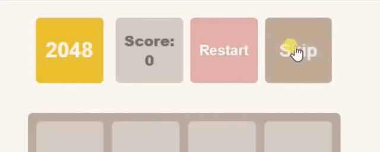
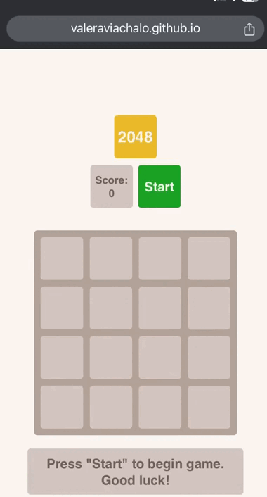

# 2048 Game

- [DEMO LINK](https://valeraviachalo.github.io/2048_game/)

## Technologies
- HTML
- SCSS
- JavaScript

### Adaptive
- Desktop: 1280px
- Mobile: > 320px

 

## Features
  ### Skip Button
  - The skip button was created to check the full functionality of the game and determine if it's possible to win without extended gameplay.

    

  - The button disappears after 5 seconds when the game starts.

    

  ### Responsive for Mobile Phones
  - The game features functionality for playing on touch devices.

    

## How to Run
1. Install Node.js version 14.18.0.
2. Open the project and run `npm install`.
3. Run `npm start`.
4. You're done.
