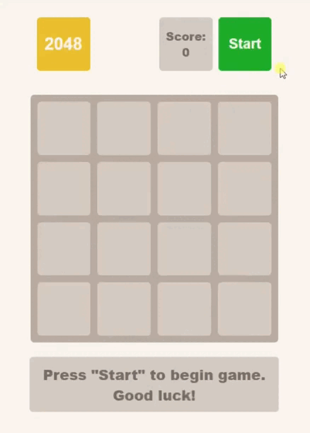

<h1> 2048 Game </h1>

  - [DEMO LINK](https://valeraviachalo.github.io/2048_game/)

# Technologies
- HTML
- SCSS
- JavaScript

## Adaptive
  - Desktop 1280px
  - Mobile (> 320px)

 

# Features
  - ## Skip button
    - The skip button was created for checking full functional of game and if we can win without long playing game

      

    - Button desapear after 5 seconds when game starts

      

  - ## Response for mobile phones
    - In the game was created functional for playing in touch devices

## How to run
1. Install node v. 14.18.0
2. Open project and run `npm i`
3. Write `npm start`
4. Done
